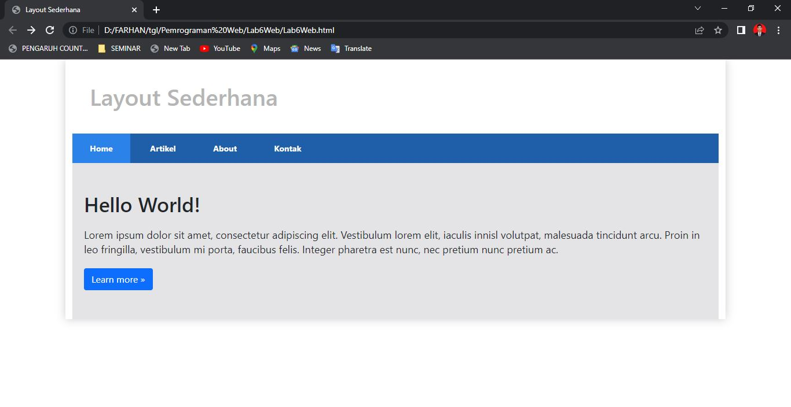

# Lab6Web
Bootstrap
| Muhammad Farhan Alfarizi | TI.20.B1 | 312010210 |
| --- | --- | ---|

 
Tugas Membuat Layout Menggunakan Twitter Bootstrap

Pada Perkuliahan Pemrograman Web Pertemuan , membuat layout seperti pertemuan 5 , tetapi kali ini saya membuat dengan menggunakan Twitter Bootstrap. Dimana Website tersebut bisa menjadi responsive atau mengikuti semua device yang dipakai oleh user.
 

**MEMBUAT HEADER DAN HERO**
Untuk langkah pertama, saya akan membuat halaman baru dengan nama index.html dimana didalam file tersebut sudah saya masukkan file Bootstrap dan Javascript yang ada. Hasil dari source code tersebut akan menampilkan output pada browser seperti gambar dibawah ini.

Membuat 2 Kolom Berisi Heading dan Widget Header
 

Saat ini saya akan membuat baris baru menggunakan <div=class="row"> menjadi 2 bagian. Dimana sisi saya bagi dari 8 kolom dan sisi kanan 4 kolom.

