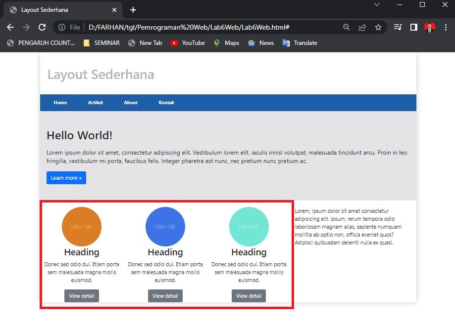
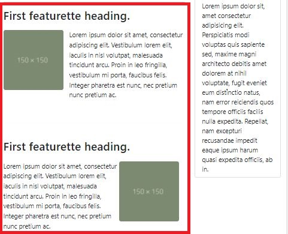

# Lab6Web
Bootstrap
| Muhammad Farhan Alfarizi | TI.20.B1 | 312010210 |
| --- | --- | ---|

 

Tugas Membuat Layout Menggunakan Twitter Bootstrap

Pada Perkuliahan Pemrograman Web Pertemuan , membuat layout seperti pertemuan 5 , tetapi kali ini saya membuat dengan menggunakan Twitter Bootstrap. Dimana Website tersebut bisa menjadi responsive atau mengikuti semua device yang dipakai oleh user.
 

**MEMBUAT HEADER DAN HERO**

Untuk langkah pertama, saya akan membuat halaman baru dengan nama index.html dimana didalam file tersebut sudah saya masukkan file Bootstrap dan Javascript yang ada. Hasil dari source code tersebut akan menampilkan output pada browser seperti gambar dibawah ini.

**MEMBUAT 2 KOLOM BERISI HEADING DAN WIDGET HEADERS**
 

Saat ini saya akan membuat baris baru menggunakan <div=class="row"> menjadi 2 bagian. Dimana sisi saya bagi dari 8 kolom dan sisi kanan 4 kolom.

 

**MEMBUAT WIDGET LAYOUT**

Pada point terakhir saya akan membuat Widget Layout yang ada di sisi sebelah kanan. Source code yang saya tambahkan adalah seperti berikut. Hasil dari source code tersebut ketika di running pada web browser akan menampilkan gambar seperti dibawah ini.

**MEMBUAT KONTEN ARTIKEL**

Kali ini saya akan membuat content article menggunakan bootstrap. dimana setiap artikel yang ditambahkan akan ada foto di sisi kiri dan kanan. Saya akan menambahkan beberapa source code untuk content article. Hasil dari source code tersebut ketika ditampilkan pada browser seperti gambar dibawah ini. 

**MENAMBAHKAN FOOTER**

Pada point ini saya akan menambahkan footer menggunakan Bootstrap. Source code yang saya gunakan untuk membuat footer adalah sebagai berikut.Hasil dari source code tersebut apabila di running di Web Browser akan menampilkan seperti gambar dibawah ini 

**HASIL WEBSITE**

